A separate draft for the five-minute talk, built around your proposed Hessian ladder. The live deck has not been edited. The poster and accepted ending are carried over from the current deck.

**One idea:** connected rainfall creates a joint estimation problem; the Hessian helps us retain those connections in a manageable local approximation.

[Open the click-through draft](science-slam-draft.html). Use the arrow keys. Speaker cues are embedded in the presentation; the same cues appear below. These are prompts for developing your delivery, not a timed script.

## Running order

| Beat | Time | Purpose |
| --- | ---: | --- |
| Poster + rain | 35 s | Establish the character and the problem |
| Three imaginary places | 30 s | Isolate level, spread and tail against one shared reference |
| Three stations | 20 s | Establish the same nine quantities used in the matrix |
| Uncertainty + Hessian | 35 s | Switch explicitly from rainfall to parameter uncertainty |
| Separate / within / between | 85 s | Let the structure build; spend 45 seconds on the research step |
| Return to the storm | 30 s | Explain why the links matter |
| Ending + poster | 15 s | Finish with the accepted line and visual callback |
| **Total** | **250 s** | **50 seconds remain for pauses, laughter and transitions** |

There are 13 visual states but eight narrative beats: the three GEV panels and the three matrix patterns build with clicks. The matrix stays in the same position and keeps the same row/column ordering throughout.

## The three reveals

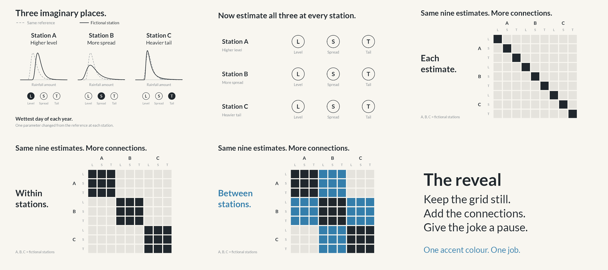{fig-alt="Fictional station distributions, the nine parameter tokens, and three progressively connected Hessian patterns."}

The biggest distinction to preserve aloud: within-station links arise because we estimate three quantities from one record; between-station links here enter because rainfall records are dependent. Give that last step the most time.

## The fictional stations

The author chose imaginary locations on 23 September 2026. A, B and C are teaching examples with no geographical claims. Every panel uses the same axes and dashed reference curve; compare each station with that reference, not with the preceding station.

| Distribution | Location / level | Scale / spread | Shape / tail | What changes |
| --- | ---: | ---: | ---: | --- |
| Dashed reference | 45 | 12 | 0.10 | Common comparison, not a fourth station |
| Station A | 65 | 12 | 0.10 | Location parameter only |
| Station B | 45 | 22 | 0.10 | Scale parameter only |
| Station C | 45 | 12 | 0.45 | Shape parameter only |

The filled token marks the parameter changed for the illustration. On the next slide, all nine tokens have equal emphasis: we estimate all three parameters at every station. Changing one parameter can affect several distributional features; the labels are intuitive descriptions, not a claim that shape only affects the tail. Distinct marginal distributions do not determine dependence between stations.

## Speaking cues and visual sequence

### The worrying · 15 seconds

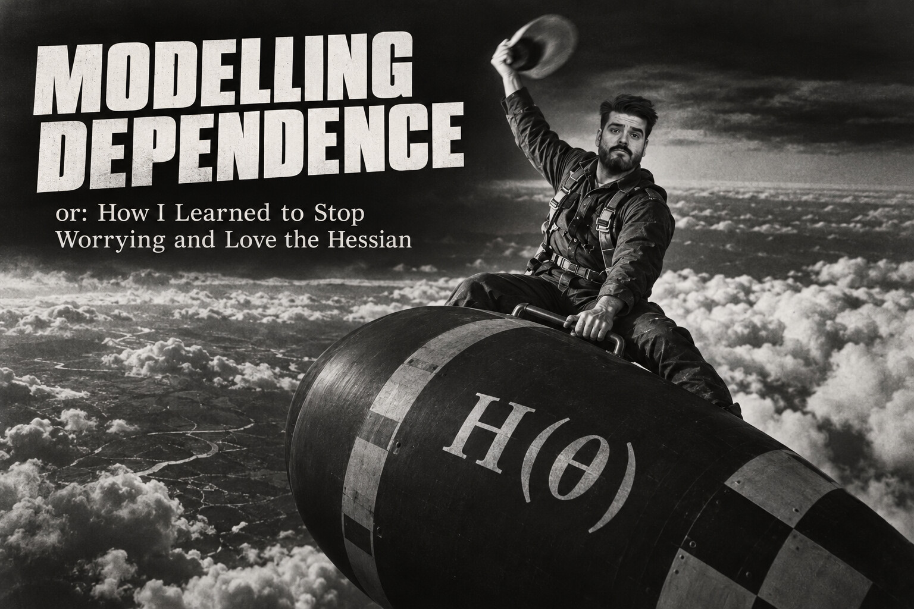{width=85% fig-alt="The worrying"}

Let the poster register. Introduce your research as modelling extreme rainfall. Establish the apparently unreasonable attachment to a Hessian; do not explain the film reference. Keep the opening in your own voice.

### Why connected rainfall matters · 20 seconds

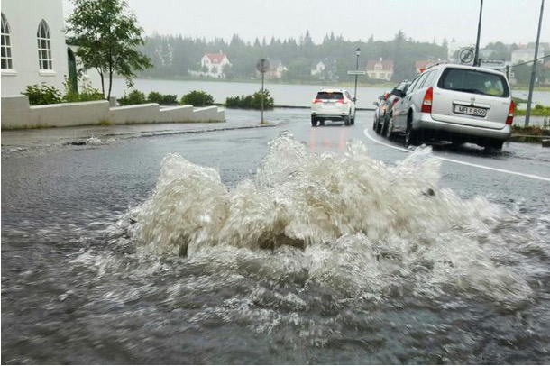{width=85% fig-alt="Why connected rainfall matters"}

Use the flood photograph as motivation. A severe storm can affect more than one station. The question is how to represent that connection when we estimate rainfall extremes. This is a photograph of Reykjavik in 2016, not paired evidence from several stations. Photo: Julius Sigurjonsson, mbl.is; original attribution retained in the preparation notes.

### Station A: higher level · 10 seconds

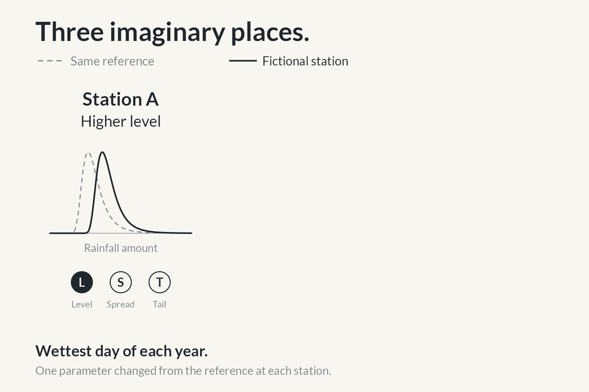{width=85% fig-alt="Station A: higher level"}

Three imaginary places. The dashed curve is the same reference in every panel. At A, move the level up: its annual biggest downpours tend to be larger. Point to the horizontal shift. These are invented distributions, not fitted observations.

### Station B: more spread · 10 seconds

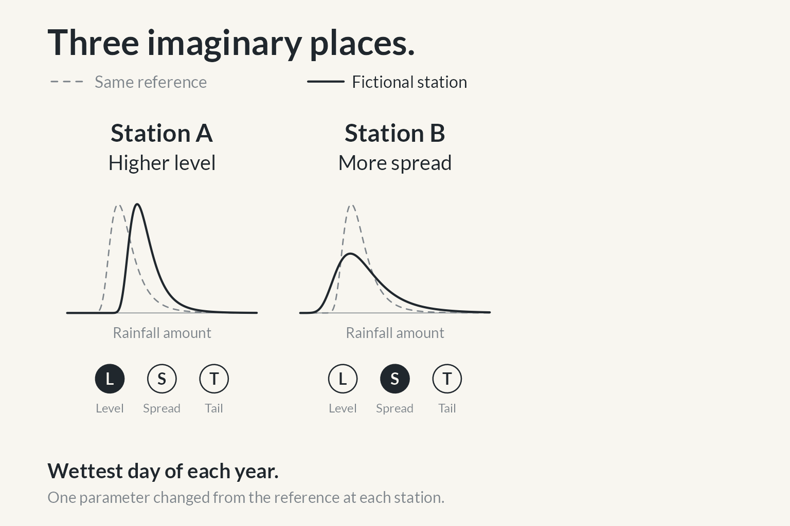{width=85% fig-alt="Station B: more spread"}

At B, increase the spread: those annual maxima vary more from year to year. Compare B with its dashed reference, not with A. The level and tail parameters remain at their reference values. This is rainfall variability, not parameter uncertainty.

### Station C: heavier tail · 10 seconds

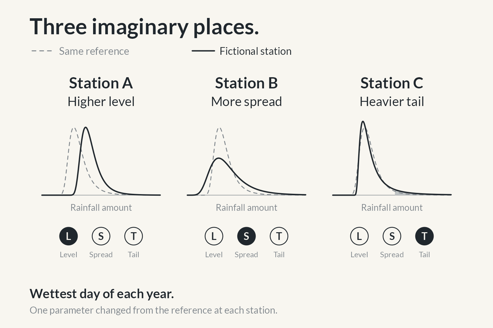{width=85% fig-alt="Station C: heavier tail"}

At C, increase the tail parameter: exceptionally large downpours become more plausible. Point to the shaded far tail. Changing shape can also affect the centre and spread of the distribution; we have held the other parameters fixed, not all other distributional features.

### Three stations: nine estimates · 20 seconds

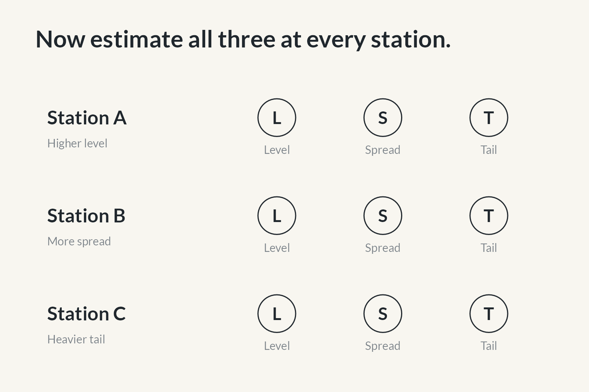{width=85% fig-alt="Three stations: nine estimates"}

These examples changed one setting at a time. In practice, we estimate all three at every station: three stations, nine estimates. All nine tokens now have equal emphasis. Different rainfall distributions do not yet tell us how the stations behave together. Keep A-B-C and L-S-T in this order for the grid.

### Give ourselves a Hessian · 35 seconds

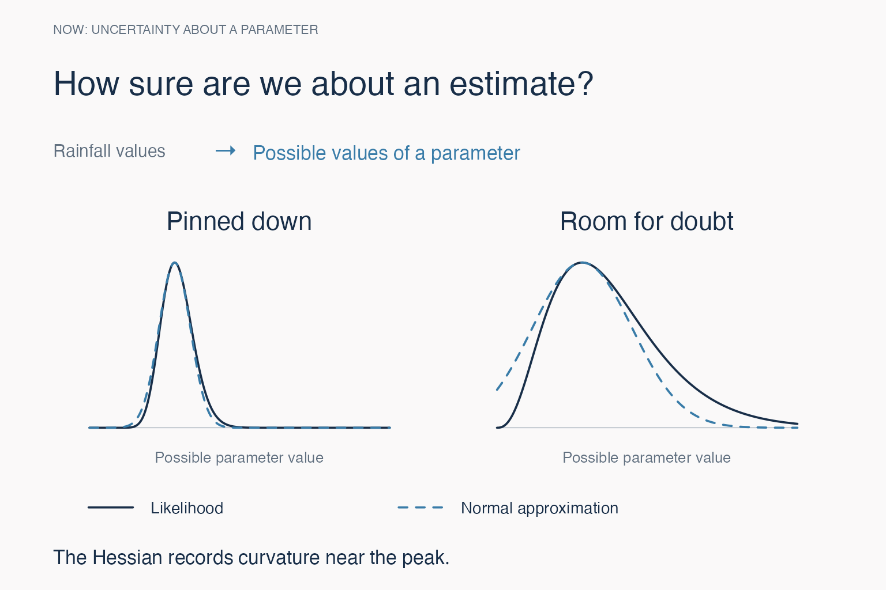{width=85% fig-alt="Give ourselves a Hessian"}

Now we are looking at possible parameter values, rather than possible rainfall values. A sharp peak pins an estimate down; a broad peak leaves room for doubt. The Hessian measures curvature near the peak, which helps us construct a normal approximation. With several parameters, it also records how their estimates are coupled. That information can be drawn as a grid. These are toy likelihood curves, not fitted GEV likelihoods.

### First: ignore the connections · 15 seconds

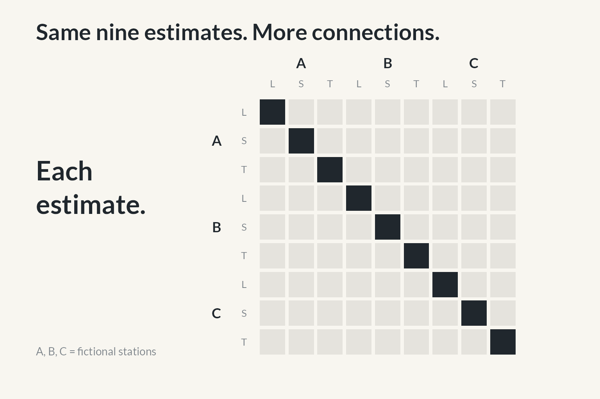{width=85% fig-alt="First: ignore the connections"}

Each row and column is one of our nine quantities. Start with the simplest picture: keep uncertainty for each one, but pretend all those uncertainties are separate. Point to one diagonal entry. This is a deliberate approximation, not a claim that a three-parameter GEV naturally has a diagonal Hessian.

### Then: keep links within a station · 25 seconds

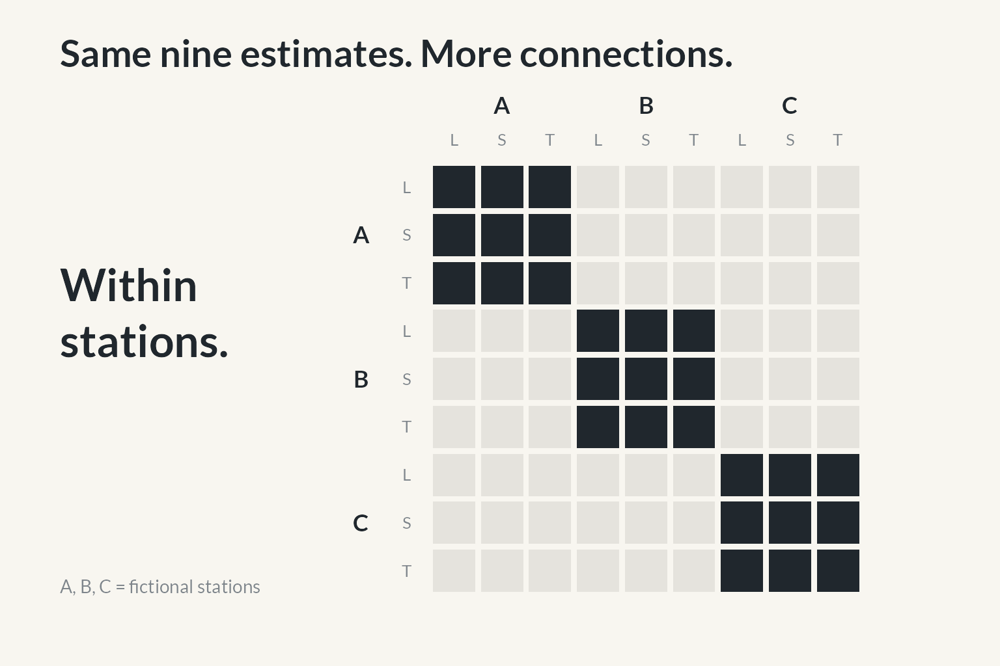{width=85% fig-alt="Then: keep links within a station"}

But we estimate a station's three quantities from the same record. Different combinations can fit similar observations, so those estimates are linked. The three-by-three block keeps those links. Point to just one block, then show that the other two stations have their own. We are still treating the station records separately in the likelihood.

### The research moment: links between stations · 45 seconds

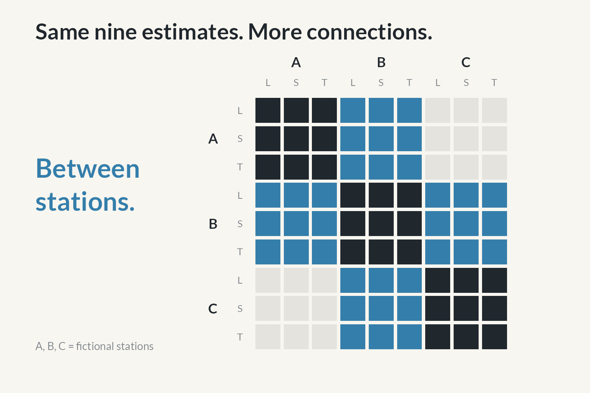{width=85% fig-alt="The research moment: links between stations"}

Now let the rainfall records be dependent between stations. The same storm can affect several places, and the likelihood couples estimates across station boundaries. Point to one newly blue block. This is the part I work on: carrying those connections into an approximation we can compute with. Optional joke: Those extra blue squares took several years. Pause before returning to the science. These are schematic links for a three-station chain; the colours do not show numerical Hessian values.

### Return to the rainfall · 30 seconds

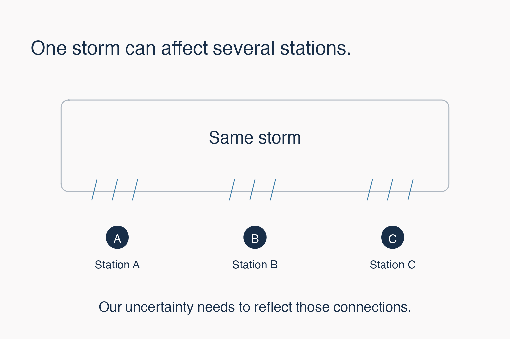{width=85% fig-alt="Return to the rainfall"}

Bring the story back to the storm. Several records can contain overlapping information about the same weather. Treating them as unrelated can misrepresent our uncertainty. The point of the extra connections is to reflect that dependence when estimating extremes. The normal approximation remains an approximation; we are making it account for more of the structure that matters. Avoid adding an unsupported claim about forecast accuracy or speed.

### The accepted ending · 10 seconds

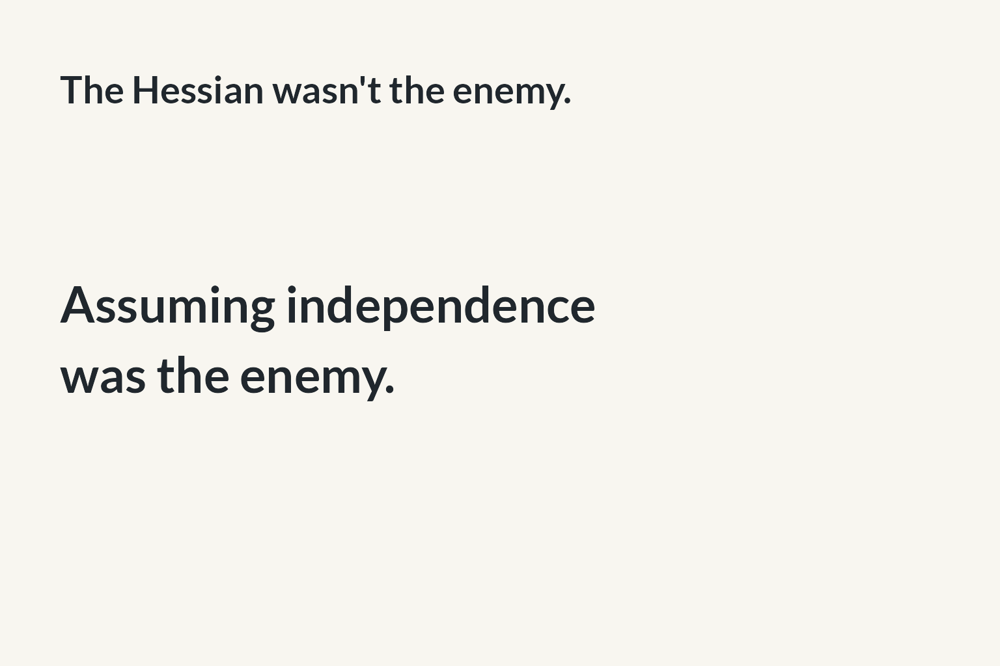{width=85% fig-alt="The accepted ending"}

The Hessian wasn't the enemy. Assuming independence was the enemy. Pause between the two sentences. The independence here refers back to treating connected rainfall records as unrelated, rather than declaring every independence assumption wrong.

### Ride the Hessian · 5 seconds

Return to the poster. Hold it, finish, and stop. Do not introduce another scientific point.

## Keep these details in the preparation notes

- **What the matrices represent:** schematic likelihood Hessian structure, and hence the local Gaussian approximation to the likelihood when the curvature has the appropriate definiteness. They are not measured Hessians from your research pipeline.
- **Diagonal:** deliberately drops mixed curvature. An ordinary GEV likelihood generally couples location, scale and shape; the diagonal is not the automatic result of assuming independent station records.
- **Within-station blocks:** records are treated separately in the likelihood. This does not rule out a spatial prior that links parameters between stations elsewhere in a hierarchical model.
- **Between-station blocks:** a toy chain connects A–B and B–C. A blank A–C block indicates no direct coupling in this illustration; it does not claim marginal independence. The drawing is not a geographical claim about real weather.
- **Colour:** dark ink retains the within-station entries, blue marks the added between-station entries, and pale grey marks zeros. Colour shows the pattern only, not sign or magnitude.
- **Curves:** the GEV panels vary one parameter at a time from a common baseline (location 45, scale 12, shape 0.1). The later narrow/broad peaks are illustrative exponential-rate relative likelihoods, not GEV fits. Their dashed curves are local normal approximations. No empirical result is asserted.
- **Technical translation:** the negative Hessian of the log likelihood at a suitable maximum gives the precision of the local normal likelihood approximation. Keep the sign convention and inversion off the stage.
- **Rehearsal cut:** if the middle runs long, shorten the peak explanation to one sentence and move on. Do not cut the transition that explains why links appear between stations.
- **Photograph:** Reykjavík, 2016, Júlíus Sigurjónsson, mbl.is; attribution copied from the existing deck. The user-provided poster is unchanged.

## Source and reuse

The PNG figures are 1536 × 1024 pixels; matching SVGs provide vector versions. `make-visuals.R` rebuilds the new figures with installed `grid`, `ragg` and `svglite`. The current fictional-station panels and simplified matrices come from `slide-designs.R` (also using `png`). Run the figure scripts from this directory, then render either `.qmd` with Quarto. The two HTML files embed their images and presentation assets.

Reference checks: [GEV parameters](https://search.r-project.org/CRAN/refmans/evd/html/gev.html), [Laplace approximation](https://mc-stan.org/docs/reference-manual/laplace.html), and [zeros in a Gaussian precision matrix](https://stephens999.github.io/fiveMinuteStats/normal_markov_chain.html).

The figures were inspected directly and text bounds checked at generation time. HTML build verification does not establish how the deck will look on the venue projector; rehearse it on the actual display.
