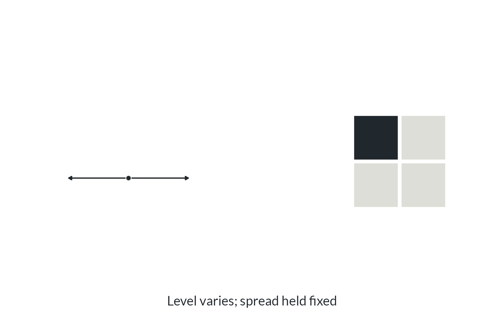
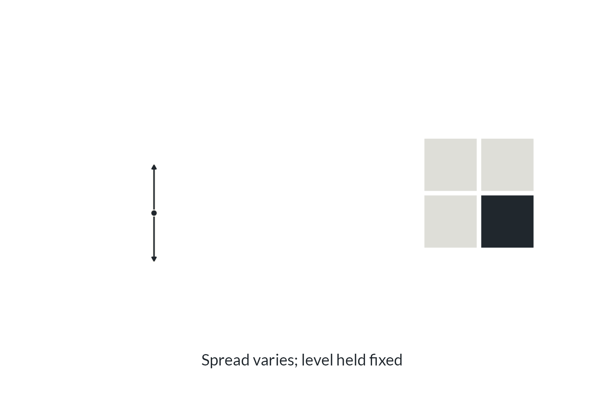
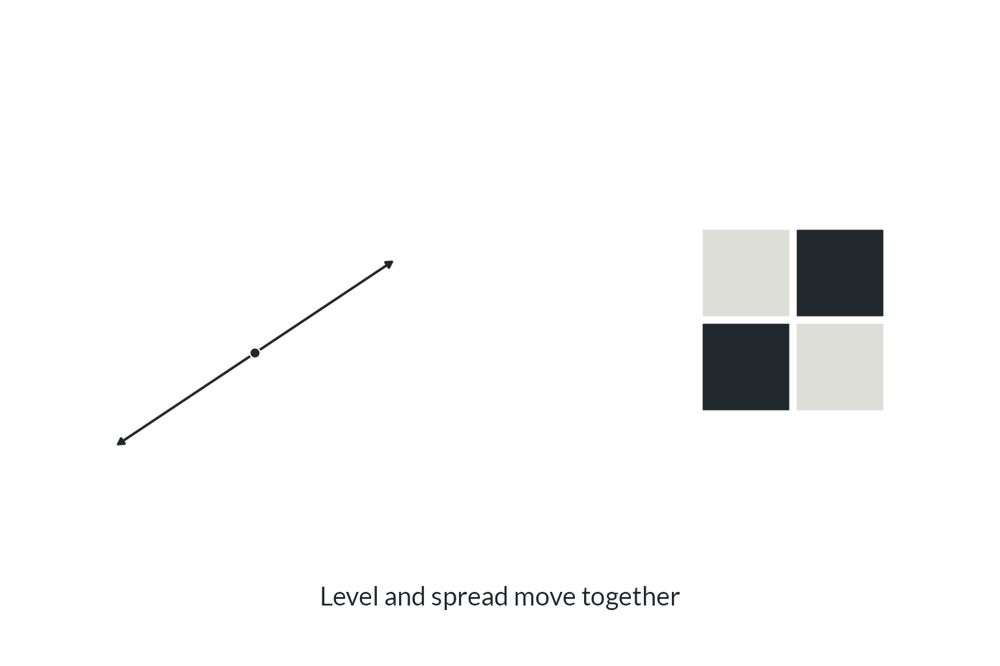

## {#poster .art background-image="Figures/bomb.jpg" background-size="contain" background-color="#000000"}

::: {.notes}
**The worrying — 15 seconds.**

Introduce yourself, give the name of your PhD project and name your advisor. Introduce the research as predicting changes in annual maximum hourly precipitation: the wettest hour of each year. Let the poster carry the humour; keep the introduction in your own voice.
:::

## {#rain .print}

{.flood .nostretch}

[Reykjavík, 2016 · Photo: Júlíus Sigurjónsson, mbl.is]{.photo-credit}

::: {.notes}
**Why changing rainfall extremes matter — 20 seconds.**

Predicting changes in extreme sub-daily precipitation matters for infrastructure planning. Engineers use estimates of rare events, such as hundred-year floods, when designing infrastructure. If the process governing extreme rainfall changes with time, a threshold considered a hundred-year event today might become an eighty- or fifty-year event later. These are illustrative possibilities, not numerical findings from this project. Keep the distinction between rainfall extremes and the resulting floods clear.

Preparation detail: a hundred-year event denotes a 1% annual exceedance probability under the conditions being described; a fifty-year event denotes 2%. The fixed threshold can become more likely as the distribution changes. The photograph shows Reykjavik in 2016 and motivates the stakes; it is not evidence for a particular return period or trend. Photo: Julius Sigurjonsson, mbl.is; original attribution retained in the preparation notes.
:::

## {#level .art background-image="design-studies/designs/stations-1.png" background-size="contain" background-color="#f8f6f0"}

::: {.notes}
**Station A: higher level — 10 seconds.**

Name the generalised extreme value (GEV) distribution without explaining it in detail. It describes the wettest hour of each year using three parameters: location (level), scale (spread), and shape (particularly the behaviour of the most extreme downpours). Every station has all three; the examples change one parameter at a time.

Three imaginary places, with the same dashed reference in each panel. At A, move the location parameter up: the wettest hour tends to bring more rain. Point to the horizontal shift. These are invented distributions, not fitted observations.
:::

## {#spread .art background-image="design-studies/designs/stations-2.png" background-size="contain" background-color="#f8f6f0"}

::: {.notes}
**Station B: more spread — 10 seconds.**

At B, increase the scale parameter, or spread: the wettest hour varies more from year to year. Compare B with its dashed reference, not with A. The location and shape parameters remain at their reference values. This is rainfall variability, not parameter uncertainty.
:::

## {#tail .art background-image="design-studies/designs/stations-3.png" background-size="contain" background-color="#f8f6f0"}

::: {.notes}
**Station C: heavier tail — 10 seconds.**

At C, change the shape parameter to give a heavier tail: exceptionally large hourly downpours become more plausible. Point to the shaded far tail.

Preparation detail: shape changes more than just the far tail. It can also affect the centre and spread of the distribution; we have held the location and scale parameters fixed, not all other distributional features.
:::

## {#stations .art background-image="design-studies/designs/station-tokens.png" background-size="contain" background-color="#f8f6f0"}

::: {.notes}
**Three stations: rainfall records to nine estimates — 20 seconds.**

Each bar is the wettest hour of one year. Use each station's history to estimate its level, spread and tail: three stations, nine estimates. Follow one row from observations to the three numbers, then gesture to the other rows. Each dot marks an estimate on a small scale. Compare down a column: A has the highest level, B the greatest spread and C the heaviest tail; their other estimates differ too. The earlier examples changed one parameter at a time; now every station has all three. These are invented records, not research observations.

Preparation detail: dot positions are schematic, not numerical GEV fits to the illustrated records. Each parameter has its own scale, held fixed across stations; the grey tracks are axes, not uncertainty intervals.

Transition: those estimates are our best guesses, but how sure are we? Zoom in on level and spread at one station, holding tail fixed. Keep A-B-C and L-S-T in this order for the later nine-by-nine grid.
:::

## {#gauss .art background-image="Figures/gauss.png" background-size="contain" background-color="#f8f6f0"}

::: {.notes}
**Gauss makes an entrance — 8 seconds.**

A brief comic bridge from parameter estimation to the normal approximation. Let the poster make its entrance; there is no need to read its full title or explain its decorative details. Cue the return of Gauss and the normal distribution, then move to the hill for the explanation of what the approximation buys us. Keep the humorous normal-distribution/Hessian loop for that next slide.

Author-supplied GPT poster, revised 24 September 2026 with gauss2.png. Its paper background, hill and density contours echo the following slide. The poster remains comic artwork; the scientific explanation follows. The full portrait image is preserved without cropping.
:::

## {#uncertainty .art .camera-slide auto-animate="true" auto-animate-id="hessian-camera" auto-animate-duration="0.8" auto-animate-easing="ease-in-out" auto-animate-unmatched="false" background-color="#f8f6f0"}

:::: {.panorama-frame}

::::

```{=html}
<h3 class="camera-title">A normal approximation</h3>
```

::: {.notes}
**A normal approximation — 30 seconds.**

We have moved from rainfall values to possible parameter values. Each point on the hill is a combination of level and spread; height describes how well that combination fits the observations. Follow the trail from the starting point to the summit: the best-fitting combination is the maximum likelihood estimate. No need to explain an optimisation algorithm. Nearby combinations fit almost as well, and the long direction shows how the two parameters can compensate for one another.

Point to the three cues in order: maximum likelihood estimate at the summit, Hessian on the arrow, uncertainty on the right. The Hessian describes the curvature near the summit. Use it to build the normal approximation on the right: a top-down density plot, centred at the best fit. Its width shows uncertainty and its tilt shows that the estimates are linked. These are the same two parameter coordinates in both panels, with tail held fixed.

Author's humorous loop, in your own words: normal distributions make the Hessian wonderfully useful; having a Hessian makes it wonderfully convenient to build a normal approximation. We are approximating uncertainty about the parameter estimates, not assuming the rainfall observations are normal. The rainfall model remains GEV. No formulas or spoken derivation needed.

Preparation detail: the hill is a schematic Gaussian-shaped relative likelihood over centred, rescaled Level/Spread coordinates. Here its normal approximation is exact by construction; this does not demonstrate the accuracy of a normal approximation for a fitted GEV. The dashed trail is a schematic search path whose likelihood increases continuously; it is not a recorded optimiser run. Both panels use identical parameter extents, scales, axis directions and baselines; the left panel alone adds likelihood height, so its summit is above the matching parameter-plane centre. The contours are equal-density ellipses from the same full precision matrix, with covariance equal to its inverse. Their enclosed probability levels are 95%, 80%, 50% and 20%; the slide does not label percentages.
:::

## {#hessian-hill .art .camera-slide auto-animate="true" auto-animate-id="hessian-camera" auto-animate-duration="0.8" auto-animate-easing="ease-in-out" auto-animate-unmatched="false" background-color="#f8f6f0"}

:::: {.panorama-frame}


```{=html}
  
  
  
  <span class="clear-highlight fragment" data-fragment-index="3" aria-hidden="true"></span>
  <p class="independence fragment" data-fragment-index="4">Independent · standardised axes</p>
```
::::

```{=html}
<h3 class="camera-title">The Hessian</h3>
```

::: {.notes}
**The Hessian: putting the shape into a matrix — 25 seconds.**

The camera moves right: the hill leaves, the same density moves to the left and a two-by-two matrix enters on the right. Two parameters give us two rows and two columns. Click the mouse or press the right arrow for each explanation:

1. Level: the horizontal slice shows how tightly level is pinned down with spread held fixed; highlight the first diagonal entry.
2. Spread: the vertical slice shows how tightly spread is pinned down with level held fixed; highlight the second diagonal entry.
3. Interaction: highlight both off-diagonal entries and the tilted direction in which the two estimates can move together. The full matrix determines the joint shape, including the direction's width.
4. Clear the tilted line and the matrix highlight, returning to the clean density and full matrix. Pause here before changing the picture.
5. Independence: the contours round into circles as the off-diagonal entries fade. This illustration also standardises both axes; independence removes the tilt, while equal standardised uncertainty makes the contours circular.

One highlight replaces the previous one. Keep the explanation in your own words; the short captions carry the held-fixed qualification.

Bridge straight to the next slide: level and spread gave us two-by-two; three parameters at each of our three stations give us nine-by-nine. The next click after the fifth reveal advances to that nine-by-nine grid; the left arrow reverses the independence animation, then retraces the highlights and camera movement.

Preparation detail, not spoken: the relevant Hessian is that of the log-likelihood at its peak; its negative is the precision for the normal approximation. Because this relative likelihood equals one at the peak and has zero gradient there, its Hessian at the peak equals the log-likelihood Hessian. A diagonal entry of the precision matrix is conditional precision with other parameters fixed, not the inverse marginal variance. The covariance is the inverse of the full precision matrix. Highlighted horizontal and vertical segments intersect the same density contour with the other coordinate fixed; they are not marginal standard deviations. The tilted segment illustrates interaction, not a width determined by the off-diagonal alone. Curvature in a joint direction combines diagonal and off-diagonal terms. Cell colours identify matrix positions, not numerical signs, magnitudes or correlations. The fifth reveal is an illustrative change of the normal approximation, not a refit of the rainfall model. Its four contours retain the same enclosed probability levels throughout a continuous nonsingular affine morph. It removes dependence and standardises the plotted axes together; independence alone allows unequal marginal variances and axis-aligned ellipses. Within-station parameter interaction is distinct from dependence between rainfall observations at different stations, which enters later.
:::

## {#separate .art background-image="design-studies/designs/matrix-1.png" background-size="contain" background-color="#f8f6f0"}

::: {.notes}
**First: ignore the connections — 15 seconds.**

Set up the analogy once: these nine people represent our nine parameter estimates, three at each station. The lines will show which connections the approximation keeps. For now, everyone works alone: keep uncertainty for each estimate, but treat those uncertainties as independent. Point from one person to a diagonal entry. The same L/S/T ordering runs across the columns and down the rows; the brackets enclose the Hessian matrix.

Preparation detail: use “independent” or “working alone”, rather than “iid”: these uncertainties need not be identically distributed. This is an approximation to parameter uncertainty, not a claim that the estimates were fitted separately or that a three-parameter GEV naturally has a diagonal Hessian. Darker cells indicate larger illustrative absolute entries, not greater correlation or marginal certainty. The toy Hessians are symmetric and negative definite (their negatives are positive-definite precision matrices). Shading uses one fixed scale and preserves retained entries across the three slides to make the structural comparison easy; these are not three fitted research results.
:::

## {#within .art background-image="design-studies/designs/matrix-2.png" background-size="contain" background-color="#f8f6f0"}

::: {.notes}
**Then: keep links within a station — 25 seconds.**

Now each station's group can whisper among themselves. They estimated their three quantities from the same rainfall record, so different combinations can fit similar observations. The triangle of connections within one group corresponds to its three-by-three matrix block. Point to one group and its matching block; the same happens at the other two stations. Nobody shares across station boundaries yet.

Keep “whispering” as the author's communication analogy, without introducing the telephone game's garbled-message idea. The people stand for linked parameter estimates, not literal messages or a fitting algorithm. At this stage the station records are still treated separately in the likelihood.
:::

## {#between .art background-image="design-studies/designs/matrix-3.png" background-size="contain" background-color="#f8f6f0"}

::: {.notes}
**The research moment: links between stations — 45 seconds.**

Now the groups share openly with their neighbours. The same storm can affect several stations, so the likelihood couples estimates across station boundaries. Point from one blue bridge between groups to its blue off-diagonal block and the matching block across the diagonal: a single connection is represented symmetrically in the matrix. This is the part I work on: carrying those connections into an approximation we can compute with. Optional joke: Those extra blue squares took several years. Pause before returning to the science.

Preparation detail: the blue bridges connect whole station groups, matching entire blocks rather than just one pair of parameters. This is an illustrative A–B–C chain. A and C have no direct precision link, but can still be associated through B; do not describe the blank corner blocks as unconditional independence. Colours distinguish within-station and between-station entries; opacity shows illustrative absolute magnitude on the same scale, not correlations or fitted values.
:::

## {#callback .art background-image="Figures/bomb.jpg" background-size="contain" background-color="#000000"}

::: {.notes}
**The ending, spoken over the poster — 15 seconds.**

The Hessian wasn't the enemy. Assuming independence was the enemy. Pause between the two sentences. The independence here refers back to treating connected rainfall records as unrelated, rather than declaring every independence assumption wrong.

Return to the poster. Hold it, finish, and stop. Do not introduce another scientific point.
:::
