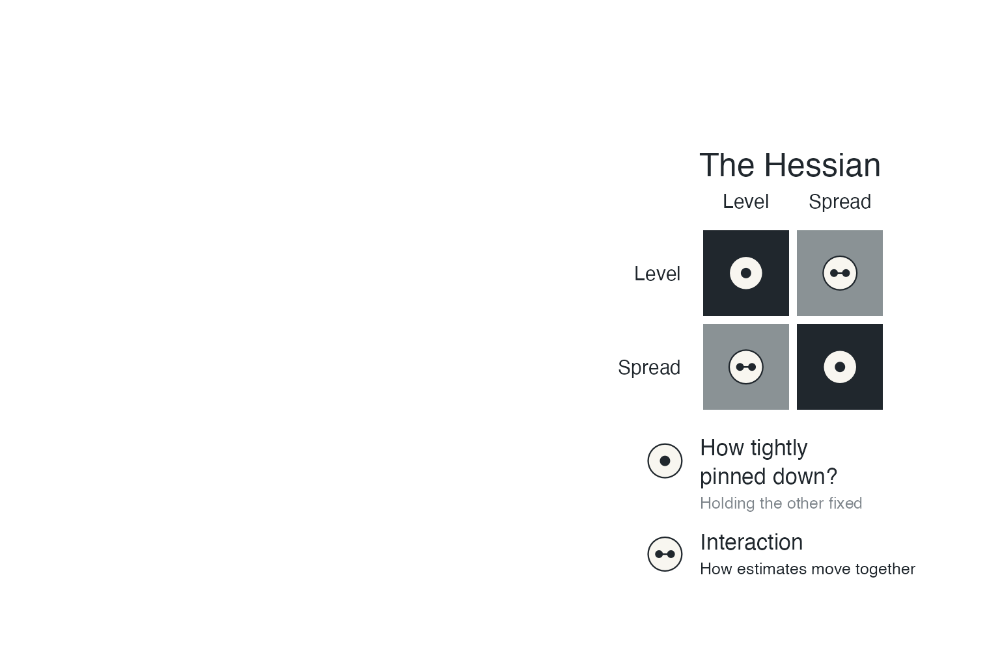

## {#poster .art background-image="Figures/bomb.jpg" background-size="contain" background-color="#000000"}

::: {.notes}
**The worrying — 15 seconds.**

Let the poster register. Introduce your research as modelling extreme rainfall. Establish the apparently unreasonable attachment to a Hessian; do not explain the film reference. Keep the opening in your own voice.
:::

## {#rain .print}

{.flood .nostretch}

[Reykjavík, 2016 · Photo: Júlíus Sigurjónsson, mbl.is]{.photo-credit}

::: {.notes}
**Why connected rainfall matters — 20 seconds.**

Use the flood photograph as motivation. A severe storm can affect more than one station. The question is how to represent that connection when we estimate rainfall extremes. This is a photograph of Reykjavik in 2016, not paired evidence from several stations. Photo: Julius Sigurjonsson, mbl.is; original attribution retained in the preparation notes.
:::

## {#level .art background-image="design-studies/designs/stations-1.png" background-size="contain" background-color="#f8f6f0"}

::: {.notes}
**Station A: higher level — 10 seconds.**

Three imaginary places. The dashed curve is the same reference in every panel. At A, move the level up: its annual biggest downpours tend to be larger. Point to the horizontal shift. These are invented distributions, not fitted observations.
:::

## {#spread .art background-image="design-studies/designs/stations-2.png" background-size="contain" background-color="#f8f6f0"}

::: {.notes}
**Station B: more spread — 10 seconds.**

At B, increase the spread: those annual maxima vary more from year to year. Compare B with its dashed reference, not with A. The level and tail parameters remain at their reference values. This is rainfall variability, not parameter uncertainty.
:::

## {#tail .art background-image="design-studies/designs/stations-3.png" background-size="contain" background-color="#f8f6f0"}

::: {.notes}
**Station C: heavier tail — 10 seconds.**

At C, increase the tail parameter: exceptionally large downpours become more plausible. Point to the shaded far tail. Changing shape can also affect the centre and spread of the distribution; we have held the other parameters fixed, not all other distributional features.
:::

## {#stations .art background-image="design-studies/designs/station-tokens.png" background-size="contain" background-color="#f8f6f0"}

::: {.notes}
**Three stations: nine estimates — 20 seconds.**

These examples changed one setting at a time. In practice, we estimate all three at every station: three stations, nine estimates. All nine tokens now have equal emphasis. Different rainfall distributions do not yet tell us how the stations behave together. Keep A-B-C and L-S-T in this order for the grid.
:::

## {#uncertainty .art background-image="design-studies/figures/uncertainty.png" background-size="contain" background-color="#f8f6f0"}

::: {.notes}
**From rainfall to uncertainty — 20 seconds.**

Now we are looking at possible parameter values, rather than possible rainfall values. A sharp peak pins an estimate down; a broad peak leaves room for doubt. The dashed curves preview a normal approximation around each peak. Next, show what the shape means when two parameters can move together. These are toy likelihood curves, not fitted GEV likelihoods.
:::

## {#hessian-hill .art background-image="design-studies/designs/hessian-hill.png" background-size="contain" background-color="#f8f6f0"}

{.hessian-overlay .fragment .nostretch fig-alt="A two-by-two Hessian labelled Level and Spread. Matching single-dot markers link the one-parameter path to the diagonal; linked-dot markers connect joint movement to the off-diagonal interaction terms."}

::: {.notes}
**The Hessian: the shape near the best fit — 35 seconds.**

The top is our best fit. Follow the solid path: change level while holding spread fixed. How quickly the fit falls away tells us how tightly level is pinned down with spread fixed. Now the dashed path: move both parameters. One can partly compensate for the other, so their estimates can move together.

Click to reveal the grid and match the single-dot and linked-dot markers. The diagonal records curvature for each parameter with the other held fixed. The off-diagonal entries capture the interaction; together, the four squares describe how the estimates can move. Two parameters give us a two-by-two grid. Our nine estimates give us nine-by-nine. This local shape is what we use to build the normal approximation.

Preparation detail, not spoken: the illustration is a toy relative likelihood over centred, rescaled Level and Spread coordinates, holding tail fixed. The relevant Hessian is that of the log-likelihood at its peak; its negative is the precision for the normal approximation. Because this relative likelihood equals one at the peak and has zero gradient there, its Hessian at the peak equals the log-likelihood Hessian. A diagonal entry of the precision matrix is conditional precision with other parameters fixed, not the inverse marginal variance. The covariance of the normal approximation is the inverse of the full precision matrix. The curvature along the dashed path combines diagonal and off-diagonal terms: the linked-dot marker illustrates coupling, not a curve determined by a single off-diagonal entry. Cell colours identify matrix positions, not numerical signs, magnitudes or correlations.
:::

## {#separate .art background-image="design-studies/designs/matrix-1.png" background-size="contain" background-color="#f8f6f0"}

::: {.notes}
**First: ignore the connections — 15 seconds.**

Each row and column is one of our nine quantities. Start with the simplest picture: keep uncertainty for each one, but pretend all those uncertainties are separate. Point to one diagonal entry. This is a deliberate approximation, not a claim that a three-parameter GEV naturally has a diagonal Hessian.
:::

## {#within .art background-image="design-studies/designs/matrix-2.png" background-size="contain" background-color="#f8f6f0"}

::: {.notes}
**Then: keep links within a station — 25 seconds.**

But we estimate a station's three quantities from the same record. Different combinations can fit similar observations, so those estimates are linked. The three-by-three block keeps those links. Point to just one block, then show that the other two stations have their own. We are still treating the station records separately in the likelihood.
:::

## {#between .art background-image="design-studies/designs/matrix-3.png" background-size="contain" background-color="#f8f6f0"}

::: {.notes}
**The research moment: links between stations — 45 seconds.**

Now let the rainfall records be dependent between stations. The same storm can affect several places, and the likelihood couples estimates across station boundaries. Point to one newly blue block. This is the part I work on: carrying those connections into an approximation we can compute with. Optional joke: Those extra blue squares took several years. Pause before returning to the science. These are schematic links for a three-station chain; the colours do not show numerical Hessian values.
:::

## {#callback .art background-image="Figures/bomb.jpg" background-size="contain" background-color="#000000"}

::: {.notes}
**The ending, spoken over the poster — 15 seconds.**

The Hessian wasn't the enemy. Assuming independence was the enemy. Pause between the two sentences. The independence here refers back to treating connected rainfall records as unrelated, rather than declaring every independence assumption wrong.

Return to the poster. Hold it, finish, and stop. Do not introduce another scientific point.
:::
