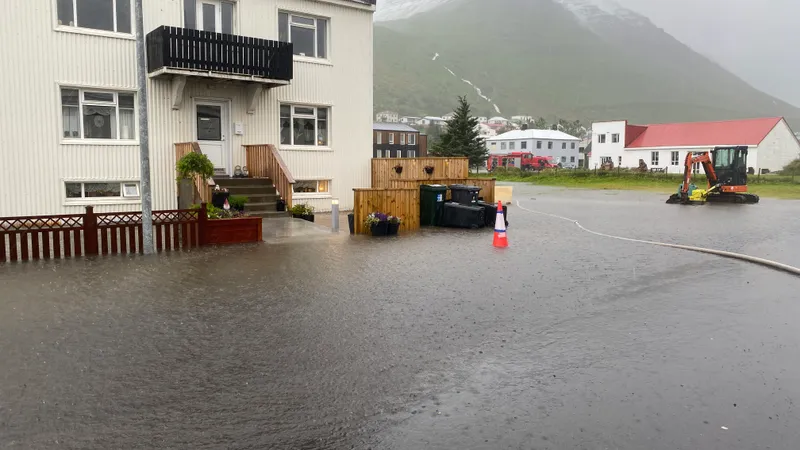
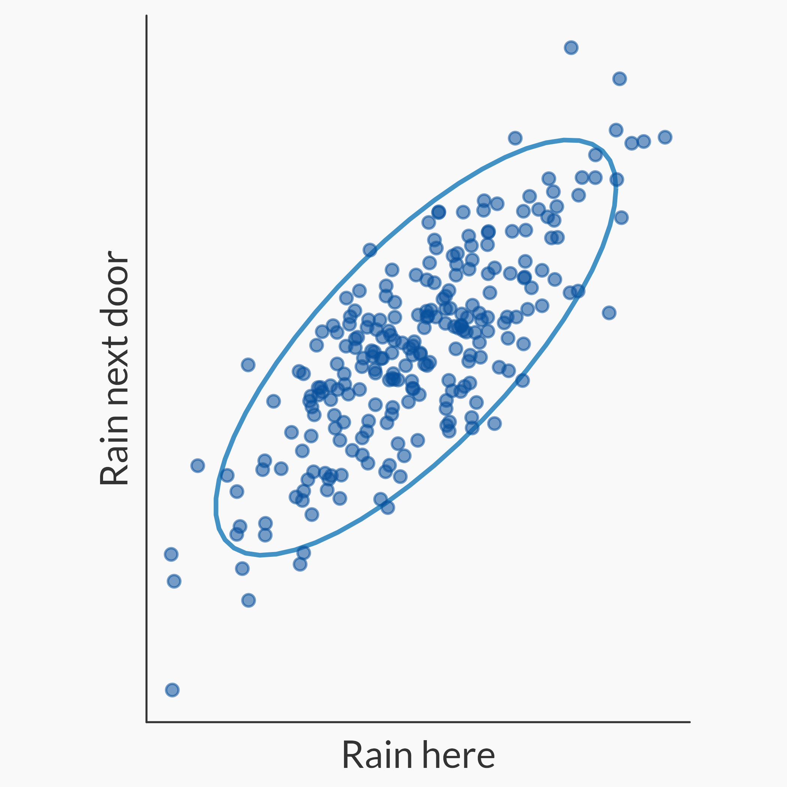
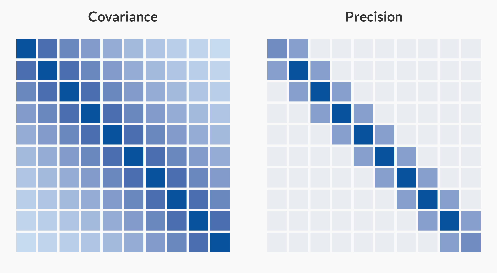
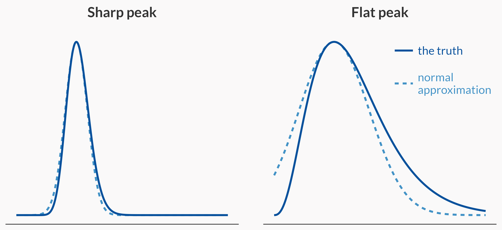
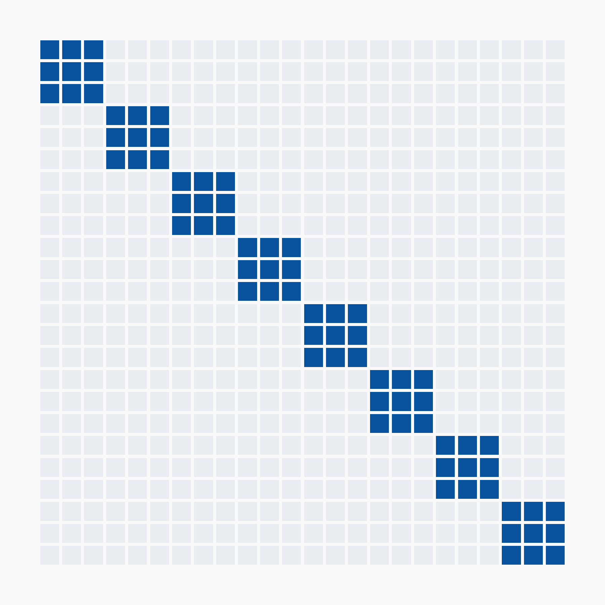
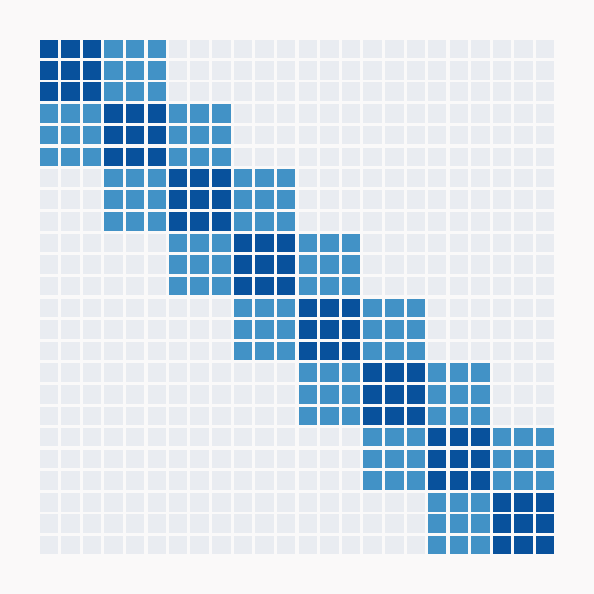

## {.no-heading .poster background-image="Figures/bomb.jpg" background-size="contain" background-color="#000000"}

::: {.notes}
~15 s. The worrying.
:::

## {.no-heading}

::: {.rain layout-ncol="2"}

:::

[Reykjavík, 2016 (photo: Júlíus Sigurjónsson, mbl.is) · Siglufjörður, 2024 (photo: Eva Björk Benediktsdóttir, RÚV)]{.photo-credit}

::: {.notes}
~20 s. When it rains hard here, it rains hard next door.
:::

## Covariance

{fig-align="center" height="480"}

::: {.notes}
~30 s. Two places: rain here, rain next door.
:::

## {.no-heading}

{fig-align="center" width="92%"}

::: {.notes}
~35 s. Ten places along a line. Blank cell = no direct link.
:::

## Give ourselves a Hessian

{fig-align="center" width="100%"}

::: {.notes}
~30 s. Just give ourselves a Hessian. Curvature at the top = precision of the normal. End on the flat peak: it's an approximation.
:::

## Three types of Hessian

::: {.r-stack}
::: {.hessian-step}
{height="420"}

[Diagonal]{.hessian-label}
:::

::: {.hessian-step .fragment}
{height="420"}

[Block diagonal]{.hessian-label}
:::

::: {.hessian-step .fragment}
{height="420"}

[Block and banded]{.hessian-label}
:::
:::

::: {.notes}
~85 s, two clicks. Bridge first: many numbers → the curvature is a grid, and that grid is a precision matrix like the ten places. Then diagonal → click → block diagonal → click → block and banded (yours): modelling data-level dependence is hard.
:::

## Every road leads back to the normal distribution {.closing}

[The Hessian wasn't the enemy.]{.fragment .punchline}

[Assuming independence was the enemy.]{.fragment .punchline}

::: {.notes}
~25 s, two clicks.
:::

## {.no-heading .poster background-image="Figures/bomb.jpg" background-size="contain" background-color="#000000"}

::: {.notes}
~5 s. Callback to the opener.
:::
