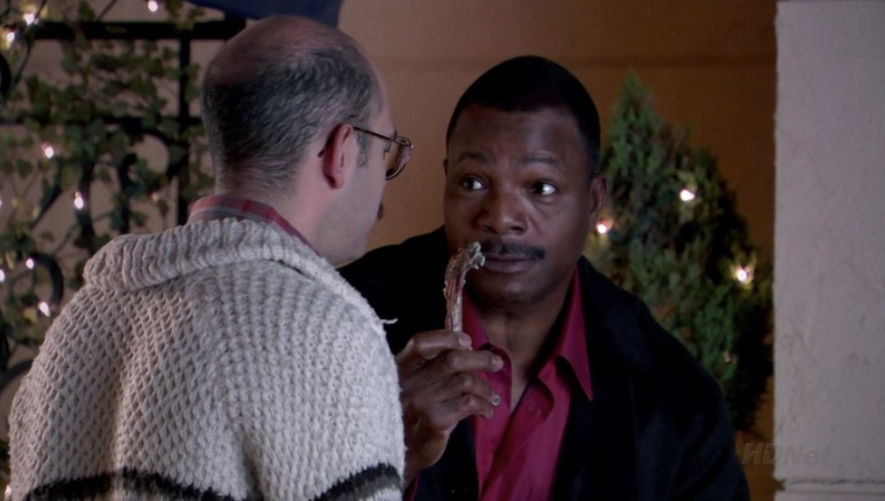

## {#opening .art .opening background-color="#f8f6f0"}

```{=html}
<p class="opening-event">Science Slam</p>
<div class="opening-topic">
  <h1>Modelling dependence</h1>
  <p>The wettest hour of the year</p>
</div>
<div class="opening-speaker">
  <p class="opening-name">Brynjólfur Gauti Guðrúnar Jónsson</p>
  <p class="opening-date">Gróska · 24 September 2026</p>
</div>
```

::: {.notes}
Name · PhD project · the wettest hour of the year
:::

## {#advisor .art background-image="Figures/birgir.png" background-size="contain" background-color="#f8f6f0"}

```{=html}
<div class="advisor-label">
  <p>PhD advisor</p>
  <h1>Birgir<br>Hrafnkelsson</h1>
</div>
```

::: {.notes}
Birgir Hrafnkelsson, my PhD advisor
:::

## {#poster .art background-image="Figures/bomb.jpg" background-size="contain" background-color="#000000"}

::: {.notes}
Pause
:::

## {#rain .print}

{.flood .nostretch}

[Reykjavík, 2016 · Photo: Júlíus Sigurjónsson, mbl.is]{.photo-credit}

::: {.notes}
Infrastructure: hundred-year events · could become eighty- or fifty-year
:::

## {#level .art background-image="design-studies/designs/stations-1.png" background-size="contain" background-color="#f8f6f0"}

::: {.notes}
GEV: level · spread · tail

A: higher level
:::

## {#spread .art background-image="design-studies/designs/stations-2.png" background-size="contain" background-color="#f8f6f0"}

::: {.notes}
B: more spread
:::

## {#tail .art background-image="design-studies/designs/stations-3.png" background-size="contain" background-color="#f8f6f0"}

::: {.notes}
C: heavier tail
:::

## {#stations .art background-image="design-studies/designs/station-tokens.png" background-size="contain" background-color="#f8f6f0"}

```{=html}
<div class="station-focus fragment current-visible" data-fragment-index="0" aria-hidden="true">
  <svg viewBox="0 0 3 1" preserveAspectRatio="none"><rect x="1" width="2" height="1"/></svg>
</div>
<div class="station-focus fragment current-visible" data-fragment-index="1" aria-hidden="true">
  <svg viewBox="0 0 3 1" preserveAspectRatio="none"><rect width="1" height="1"/><rect x="2" width="1" height="1"/></svg>
</div>
<div class="station-focus fragment current-visible" data-fragment-index="2" aria-hidden="true">
  <svg viewBox="0 0 3 1" preserveAspectRatio="none"><rect width="2" height="1"/></svg>
</div>
```

::: {.notes}
Bar = wettest hour of one year · 3 stations → 9 estimates

Clicks: level · spread · tail
:::

## {#thinking .art background-image="Figures/binni-thinking.png" background-size="contain" background-color="#f8f6f0"}

::: {.notes}
“But how do we get these estimates? And where’s the Hessian I promised you?”
:::

## {#gauss .art background-image="Figures/gauss.png" background-size="contain" background-color="#f8f6f0"}

::: {.notes}
Gauss: back to the normal distribution
:::

## {#uncertainty .art .camera-slide auto-animate="true" auto-animate-id="hessian-camera" auto-animate-duration="0.8" auto-animate-easing="ease-in-out" auto-animate-unmatched="false" background-color="#f8f6f0"}

:::: {.panorama-frame}

::::

```{=html}
<h3 class="camera-title">A normal approximation</h3>
```

::: {.notes}
Hill = fit of each level/spread pair · summit = maximum likelihood

Hessian = curvature at the summit → normal approximation

Loop: normals make the Hessian useful; the Hessian makes normals convenient
:::

## {#hessian-hill .art .camera-slide auto-animate="true" auto-animate-id="hessian-camera" auto-animate-duration="0.8" auto-animate-easing="ease-in-out" auto-animate-unmatched="false" background-color="#f8f6f0"}

:::: {.panorama-frame}


```{=html}
  
  
  
  <span class="clear-highlight fragment" data-fragment-index="3" aria-hidden="true"></span>
  <p class="independence fragment" data-fragment-index="4">Independent · standardised axes</p>
```
::::

```{=html}
<h3 class="camera-title">The Hessian</h3>
```

::: {.notes}
Pan → 2×2 matrix

5 clicks: level · spread · interaction · clear · independence

Next: 3 stations × 3 parameters → 9×9
:::

## {#separate .art .stew-slide background-image="design-studies/designs/matrix-1.png" background-size="contain" background-color="#f8f6f0"}

```{=html}
<div class="stew-header">
  
  <blockquote class="stew-caption"><p>“You take an assumption of independence”</p></blockquote>
</div>
```

::: {.notes}
9 people = 9 estimates · everyone works alone

Checkpoint ≈ 2:50
:::

## {#within .art .stew-slide background-image="design-studies/designs/matrix-2.png" background-size="contain" background-color="#f8f6f0"}

```{=html}
<div class="stew-header">
  
  <blockquote class="stew-caption"><p>“You add within-station dependence”</p></blockquote>
</div>
```

::: {.notes}
Whispering within each station · same record → linked estimates
:::

## {#between .art .stew-slide background-image="design-studies/designs/matrix-3.png" background-size="contain" background-color="#f8f6f0"}

```{=html}
<div class="stew-header">
  
  <blockquote class="stew-caption"><p>“You add spatial dependence<br> between neighbours”</p></blockquote>
</div>
```

::: {.notes}
Neighbours share · one storm, several stations

The part I work on
:::

## {#research .art .stew-slide background-image="design-studies/designs/research-bridge.png" background-size="contain" background-color="#f8f6f0"}

```{=html}
<div class="stew-header">
  
  <blockquote class="stew-caption"><p>“Baby, you got a stew going”</p></blockquote>
</div>
```

::: {.notes}
Same blocks, more stations → spatial model → map

“During my PhD, whenever a model gets so complicated that I start wondering how on earth I’m going to fit it, I come back to the most important lesson I’ve learned from Birgir…”
:::

## {#birgir-lesson .art background-image="Figures/birgir-hessian.png" background-size="contain" background-color="#f8f6f0"}

::: {.notes}
Pause
:::

## {#callback .art background-image="Figures/hessian-ending.png" background-size="contain" background-color="#f8f6f0"}

::: {.notes}
Thank you
:::
